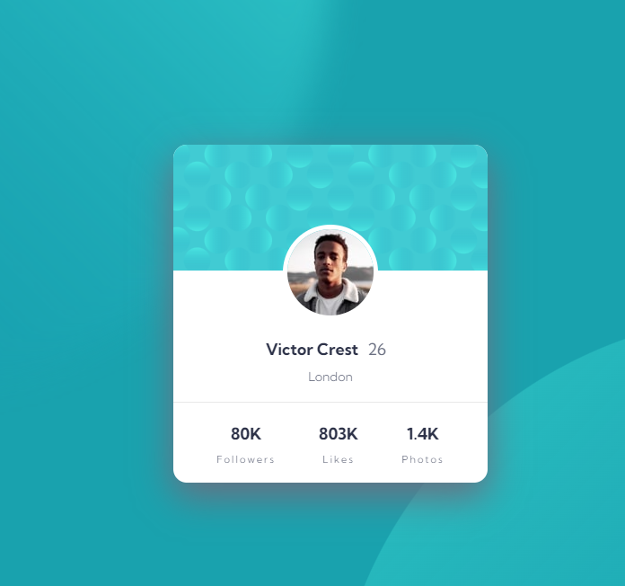

# Frontend Mentor - Profile card component solution

This is a solution to the [Profile card component challenge on Frontend Mentor](https://www.frontendmentor.io/challenges/profile-card-component-cfArpWshJ). Frontend Mentor challenges help you improve your coding skills by building realistic projects. 

## Table of contents

- [Overview](#overview)
  - [The challenge](#the-challenge)
  - [Screenshot](#screenshot)
  - [Links](#links)
- [My process](#my-process)
  - [Built with](#built-with)
  - [What I learned](#what-i-learned)
  - [Continued development](#continued-development)
  - [Useful resources](#useful-resources)
- [Author](#author)

## Overview

### The challenge

- Build out the project to the designs provided

### Screenshot

### Links

- Solution URL: (https://github.com/Ando96/profile-card-component-main)
- Live Site URL: (https://ando96.github.io/profile-card-component-main/)

## My process

### Built with

- Semantic HTML5 markup
- CSS custom properties
- Flexbox

### Continued development

Still working away improving my CSS skills, there is always room for improvement

### Useful resources

- [w3schools] https://www.w3schools.com/css/default.asp - Has everything you need when it comes to HTML and CSS basics
- [MDN] https://developer.mozilla.org/en-US/- Has a lot of useful and interesting information about the different HTML and CSS tags, I find a new attribute or tag everytime I'm looking for something

## Author

- Frontend Mentor - [@Ando96](https://www.frontendmentor.io/profile/Ando96)

